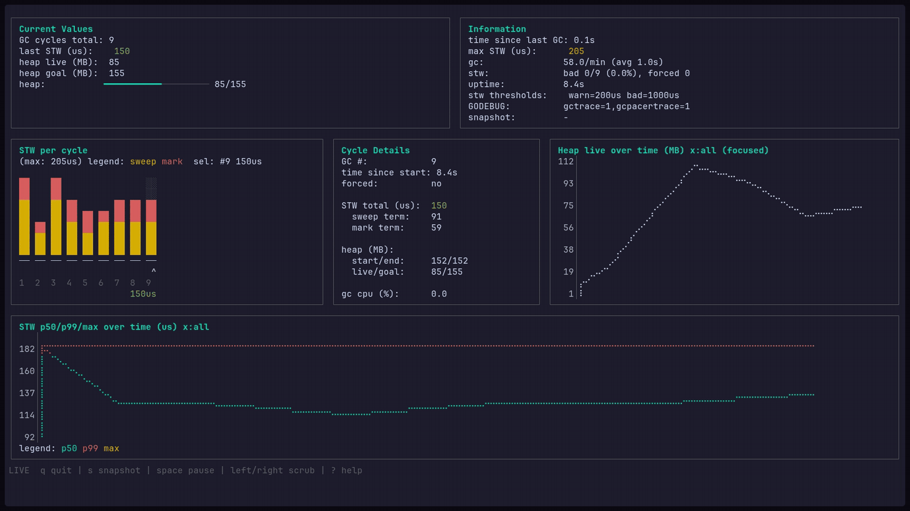
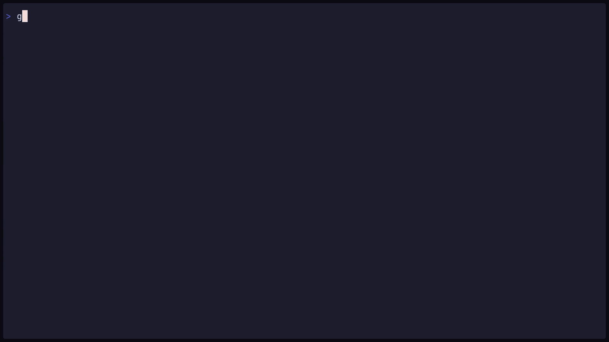
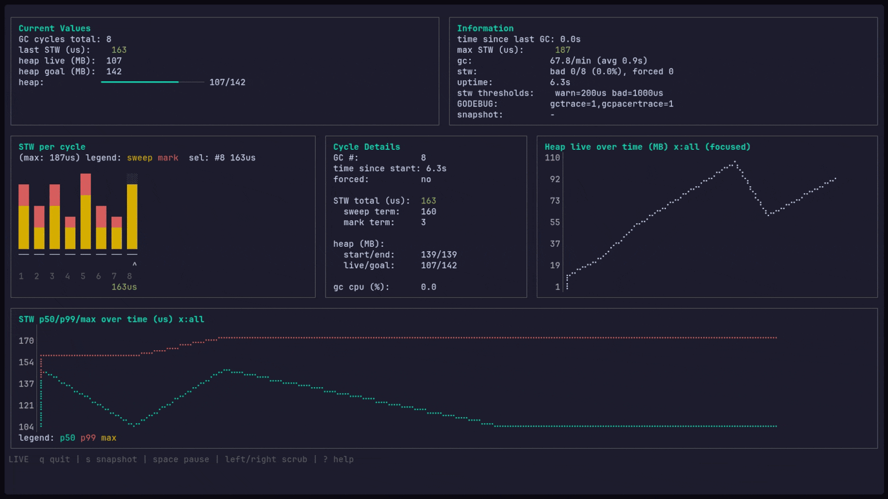

# gcviz - Go Garbage Collector Visualizer



Read this in other languages: [English](../README.md)

`gcviz` - TUI-инструмент для наблюдения за сборщиком мусора Go в реальном времени. Он показывает GC-циклы, STW-паузы, динамику heap (live/goal) и сигналы GC pacer прямо в терминале.

Типичные сценарии, где он помогает:

- быстро заметить STW пики (p99/max) под нагрузкой
- увидеть, что после изменения кода GC стал происходить чаще/реже
- понять, как heap live приближается к heap goal и почему pacing становится агрессивнее
- сравнить два запуска по snapshots (`diff`)

## Содержание

- [Как устроено](#как-устроено)
- [Быстрый старт (1 минута)](#быстрый-старт-1-минута)
- [Установка и использование как CLI](#установка-и-использование-как-cli)
- [Режимы и команды](#режимы-и-команды)
  - [run](#run-запуск-вашего-бинарника-под-наблюдением)
  - [lab](#lab-встроенные-демо-нагрузки)
  - [attach](#attach-подключение-к-runtimemetrics-http-endpoint)
  - [diff](#diff-сравнение-двух-snapshot-файлов)
- [Что показывает UI (метрики и панели)](#что-показывает-ui-метрики-и-панели)
- [Хоткеи](#хоткеи)
- [Настройки](#настройки)
  - [Флаги и передача аргументов](#флаги-и-передача-аргументов)
- [Snapshots](#snapshots)
- [Makefile: список команд и зачем они нужны](#makefile-список-команд-и-зачем-они-нужны)
- [Notes / FAQ](#notes--faq)
- [Разработка](#разработка)
- [Лицензия](#лицензия)

## Как устроено

У `gcviz` есть два режима получения данных:

- `run` (основной): запускает ваш бинарник, гарантирует `GODEBUG` с `gctrace=1,gcpacertrace=1`, и парсит `stderr` таргета.
- `attach` (вторичный): опрашивает HTTP endpoint, который экспортирует `runtime/metrics` в JSON-формате, понятном `gcviz` (через `pkg/reporter`).

Для `run` менять код приложения не нужно. Для `attach` потребуется добавить небольшой HTTP endpoint в сервис.

## Быстрый старт (1 минута)



Требования: Go 1.22+, достаточно большой терминал.

### 1) Просто попробовать на демо

Из исходников (без установки):

```bash
go run ./cmd/gcviz lab churn
```

Или через Makefile:

```bash
make lab-churn
```

Help в приложении: `?` / `h` / `f1`.

### 2) Запустить на своем бинарнике (пошагово)

1. Соберите ваш сервис/приложение в бинарник:

```bash
go build -o ./myapp ./cmd/myapp
```

2. Запустите под наблюдением (важно: `--` отделяет аргументы `gcviz` от аргументов вашей программы):

```bash
go run ./cmd/gcviz run ./myapp -- --your-flag value
```

3. В UI:

- `?` - открыть Help со всеми хоткеями
- `space` - пауза/продолжить
- в паузе `left/right` (и `home/end`) листают историю
- `s` сохраняет snapshot в `tmp/snapshots` (по умолчанию)

Если хотите использовать `gcviz` как обычный CLI (однажды установить и дальше запускать `gcviz ...`), см. следующий раздел.

## Установка и использование как CLI

Установить `gcviz` в `GOBIN`:

```bash
go install github.com/timur-developer/gcviz/cmd/gcviz@latest
```

Дальше можно запускать как обычную команду:

```bash
gcviz lab churn
gcviz run ./path/to/your-binary -- --your-flag value
gcviz attach http://127.0.0.1:8080/gcviz/metrics
gcviz diff ./a.json ./b.json
```

Встроенная справка:

```bash
gcviz --help
gcviz run --help
```

## Режимы и команды

### run (запуск вашего бинарника под наблюдением)

Запускает ваш бинарник и в реальном времени показывает события GC:

```bash
gcviz run ./path/to/your-binary
```

Этот режим предназначен для того, чтобы посмотреть, как сборщик мусора Go ведет себя именно в вашем проекте во время реального запуска.

`run` работает с уже собранным бинарником (а не с `.go` файлом), поэтому сначала соберите приложение, а затем передайте путь к исполняемому файлу в `gcviz`.

Нужны флаги `gcviz` или нужно передать аргументы вашей программе? См. раздел **Настройки**.

Из исходников:

```bash
go run ./cmd/gcviz run ./path/to/your-binary
```

Через Makefile:

```bash
make run TARGET=./path/to/your-binary
```

### lab (встроенные демо-нагрузки)

`lab` запускает встроенный синтетический workload, чтобы можно было быстро посмотреть UI и поведение хоткеев.

```bash
gcviz lab alloc
gcviz lab churn
gcviz lab idle
gcviz lab spike
```

Что примерно означает каждый пресет:

- `alloc`: ровные небольшие/средние аллокации с частичным удержанием (heap live плавно растет, GC идет стабильнее)
- `churn`: повторяющиеся крупные всплески с коротким удержанием (частые GC, удобно смотреть STW/pacer под нагрузкой)
- `idle`: почти простой, но иногда небольшие всплески (редкие GC-события, поведение при низкой активности)
- `spike`: легкий фон + периодические тяжелые волны (хорошо видно "спайки" в heap/STW паттернах)

### attach (подключение к runtime/metrics HTTP endpoint)

Подключение к уже работающему сервису, который отдает `runtime/metrics` в JSON-формате `gcviz`.

1. Добавьте `pkg/reporter` в сервис:

```go
package main

import (
	"log"
	"net/http"

	"github.com/timur-developer/gcviz/pkg/reporter"
)

func main() {
	rep := reporter.New()

	mux := http.NewServeMux()
	mux.Handle(rep.Path(), rep.Handler())

	log.Fatal(http.ListenAndServe(":8080", mux))
}
```

2. Подключитесь:

```bash
gcviz attach http://127.0.0.1:8080/gcviz/metrics
```

Важные нюансы `attach` режима:

- данные берутся из `runtime/metrics`, поэтому они отличаются от `run` режима
- env таргета (`GOGC`, `GOMEMLIMIT`, `GODEBUG`) недоступен, UI покажет `n/a`

### diff (сравнение двух snapshot-файлов)

Сравнение двух snapshot-файлов:

```bash
gcviz diff ./a.json ./b.json
```

Что выводит `diff`:

- краткую сводку по snapshot A и B (`gc_cycles_total`, `heap_live_mb`, `stw_p50/p99/max_us`)
- разницу (B-A) для `heap_live_mb` и STW метрик окна

## Что показывает UI (метрики и панели)

`gcviz` хранит скользящее окно последних GC событий (`--window-size`, по умолчанию: 200) и показывает как значения по циклам, так и агрегаты по окну.

### Current Values

- `GC cycles total`: текущий номер GC цикла
- `last STW (us)`: STW пауза последнего цикла (sweep term + mark term, в микросекундах)
- `heap live (MB)` / `heap goal (MB)`: live heap и цель
- `heap: live/goal`: компактный индикатор соотношения live/goal

### Information (агрегаты по окну)

- `max STW (us)`: максимум STW по окну
- `gc`: `GCs/min` и/или средний интервал GC
- `stw`: число/процент "bad" STW (по порогам) и количество forced GC
- `time since last GC`, `uptime`
- `stw thresholds`: `warn` / `bad` (см. настройки)
- состояние snapshot и директория snapshot
- env контекст (`GOGC`, `GOMEMLIMIT`, `GODEBUG`) в `run`/`lab` (в `attach` недоступен)

### Графики

- **Heap live over time (MB)**: heap live во времени
- **STW p50/p99/max over time (us)**: p50/p99/max STW по окну
- **STW per cycle**: bar chart по циклам; подписи можно переключать на STW или heap live (`l`)

### Cycle Details (детали выбранного цикла)

- GC #, time since start, forced
- STW total (us) + разбивка: sweep term / mark term
- heap (MB): start/end и live/goal
- gc cpu (%)
- pacer сигналы (если доступны): assist ratio, assist workers, pages swept

## Хоткеи



Полный список горячих клавиш всегда доступен в Help (`?` / `h` / `f1`).

База:

- `?` / `h` / `f1` показать/скрыть Help
- `q` / `ctrl+c` выход
- `space` пауза/продолжить обновления
- `left` / `right` листать историю (в паузе)
- `home` / `end` в начало/конец истории (в паузе)
- `s` сохранить snapshot

Интерфейс:

- `g` переключить layout (spaced/tight)
- `l` режим подписей STW bar chart (GC+STW -> GC+Heap -> GC-only)

Графики:

- `z` выбрать активный график (Heap/STW). Zoom/pan применяется к активному графику.
- `+` / `-` Y-zoom активного графика
- `0` сброс Y zoom/pan активного графика
- `shift+up` / `shift+down` Y-pan активного графика
- `[` / `]` X-zoom (масштаб по времени): all -> 1h -> 15m -> 5m -> 1m (и обратно)
- `r` полный сброс focus, zoom/pan и time span

## Настройки

Глобальные флаги (и env-оверрайды):

- `--window-size` (`GCVIZ_WINDOW_SIZE`) количество событий в памяти (default: 200)
- `--snapshot-path` (`GCVIZ_SNAPSHOT_PATH`) директория snapshots (default: `tmp/snapshots`)
- `--exit-snapshot` (`GCVIZ_EXIT_SNAPSHOT`) snapshot на выходе (default: true)
- `--no-alt-screen` (`GCVIZ_NO_ALT_SCREEN`) отключить alt screen buffer
- `--stw-warn-us` (`GCVIZ_STW_WARN_US`) порог warn для STW (default: 200)
- `--stw-bad-us` (`GCVIZ_STW_BAD_US`) порог bad для STW (default: 1000)

Режимные env:

- `GCVIZ_RUN_TARGET`
- `GCVIZ_ATTACH_URL`, `GCVIZ_POLL_INTERVAL`
- `GCVIZ_LAB_PRESET`
- `GCVIZ_DIFF_A`, `GCVIZ_DIFF_B`

Любой флаг можно задавать и через соответствующую переменную окружения `GCVIZ_*`, перечисленную выше.

### Флаги и передача аргументов

Глобальные флаги (например, `--window-size`, `--stw-bad-us`) пишутся до подкоманды, потому что они относятся ко всем режимам.

В режиме `run` разделитель `--` отделяет аргументы `gcviz` от аргументов вашей программы. Все, что после `--`, передается вашему бинарнику как есть.

Шаблон:

```bash
gcviz [глобальные флаги] run <target-binary> -- [аргументы вашей программы...]
```

Пример:

```bash
gcviz --window-size 500 --stw-bad-us 2000 run ./path/to/your-binary -- --your-flag value
```

## Snapshots

Snapshot - это JSON-файл, который фиксирует состояние "последних N GC-событий" (то же окно, которое использует UI). Его удобно сохранять для сравнения запусков, обмена и фиксации регрессий.

По умолчанию snapshots пишутся в `tmp/snapshots`.

- ручной snapshot: `s`
- snapshot на выходе включен по умолчанию; пропускается, если недавно делали ручной

Что внутри snapshot:

- текущие значения (`gc_cycles_total`, `last_stw_us`, `heap_live_mb`, `heap_goal_mb`)
- агрегаты окна (`stw_p50_us`, `stw_p99_us`, `stw_max_us`)
- список событий GC в окне (включая распарсенные pacer-поля, если они были)

## Makefile: список команд и зачем они нужны

`make help` выводит список целей. Основные:

- `make ci`: прогоняет линтер, тесты и сборку
- `make lint`: запускает `golangci-lint`
- `make test`: запускает `go test ./...`
- `make build`: `go build ./...` (быстрая проверка, что все собирается)
- `make install`: устанавливает `gcviz` в вашу Go bin директорию
- `make lab` / `make lab-churn` и т.п.: запускает демо-нагрузки
- `make run TARGET=... ARGS="-- ..."`: запускает ваш бинарник под наблюдением
- `make attach URL=...`: подключается к сервису (по умолчанию `http://127.0.0.1:8080/gcviz/metrics`)
- `make diff A=... B=...`: сравнивает два snapshot-файла

Для мейнтейнеров:

- `make testbin`: пересобирает встроенные `lab`-бинарники под все поддерживаемые OS/arch
- `make release-snapshot`: локальная сборка релиза через GoReleaser (`--snapshot --clean`)

## Notes / FAQ

- В `attach` режиме нельзя узнать env таргета (`GOGC`, `GOMEMLIMIT`, `GODEBUG`), поэтому UI показывает `n/a`.
- Если вы не видите обновлений, возможно, приложение пока не делает GC (попробуйте более аллоцирующую нагрузку или `lab churn`).
- Если терминал ведет себя странно, попробуйте `--no-alt-screen` (или `GCVIZ_NO_ALT_SCREEN=true`).
- Очень маленькие STW значения могут отображаться как 0 из-за форматирования `gctrace`.

## Разработка

```bash
make ci
make lint
make test
make build
```

## Лицензия

MIT. См. [LICENSE](../LICENSE).
